    

# pix2pixHD
### [[Project]](https://tcwang0509.github.io/pix2pixHD/) [[Paper]](https://arxiv.org/pdf/1711.11585.pdf)  
Pytorch implementation for high-resolution (e.g. 2048x1024) photorealistic image-to-image translation, for example, turning semantic label maps into photo-realistic images, or synthesizing portraits from face label maps.   
[High-Resolution Image Synthesis and Semantic Manipulation with Conditional GANs](https://tcwang0509.github.io/pix2pixHD/)  
 Ting-Chun Wang1, Ming-Yu Liu1, Jun-Yan Zhu2, Andrew Tao1, Jan Kautz1, Bryan Catanzaro1  
 1NVIDIA Corporation, 2UC Berkeley  
 In arxiv, 2017.  

## Release notice
Due to some unexpected delay, we have not got the approval from NVIDIA to release the code yet. 
We are working on it and it should be resolved in a couple of days. 
If you want to get notified once the code is released, please subscribe [here](https://tcwang0509.github.io/pix2pixHD/subscribe.html).

## Image-to-image translation at 2k/1k resolution
- Our label-to-streetview results

  
  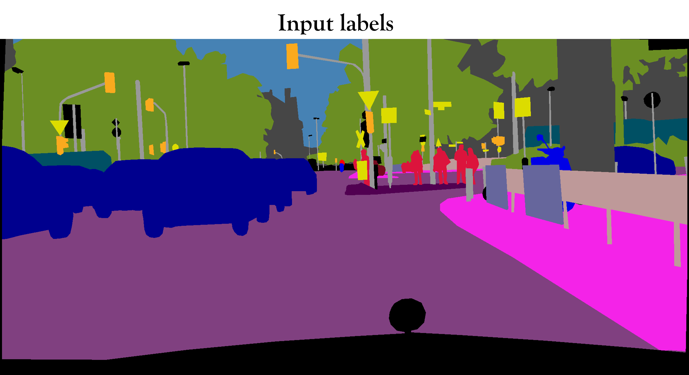
  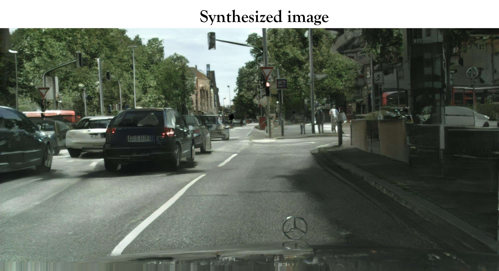

- Interactive editing results

  
  
  

- Additional streetview results

  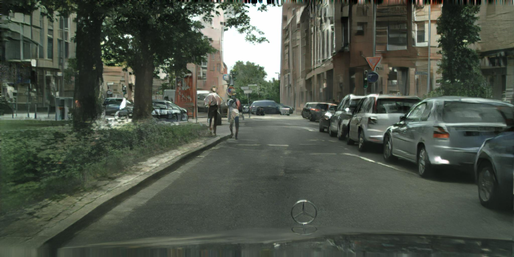
  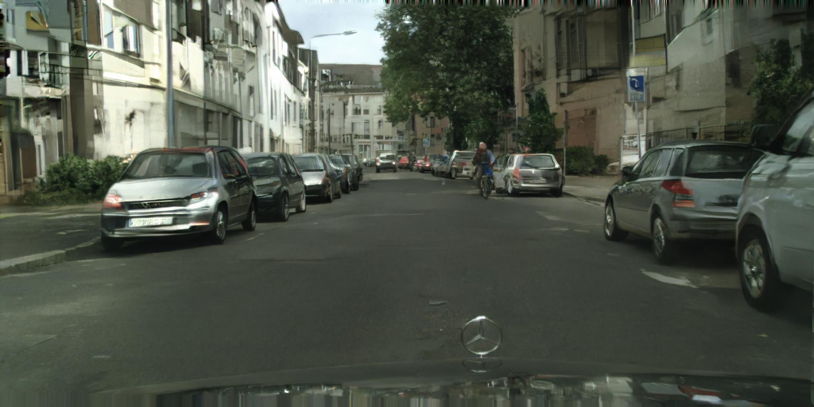

  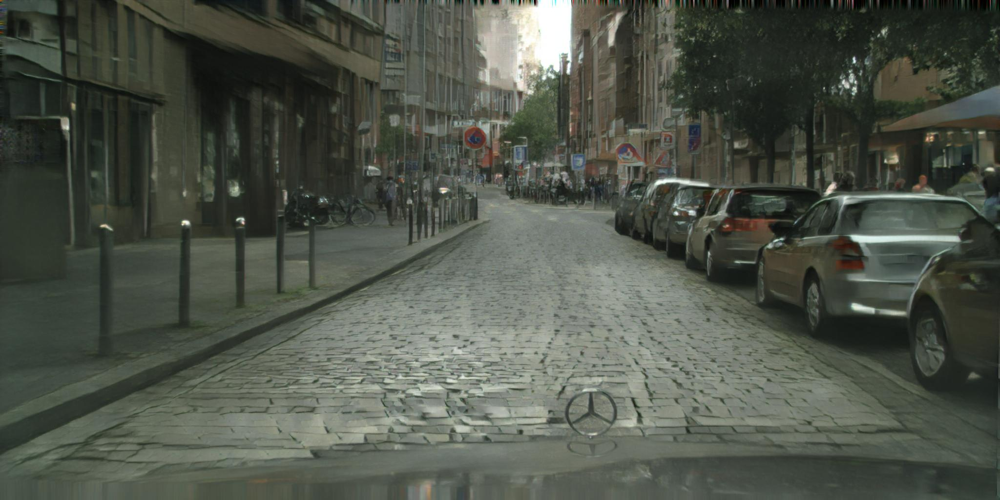
  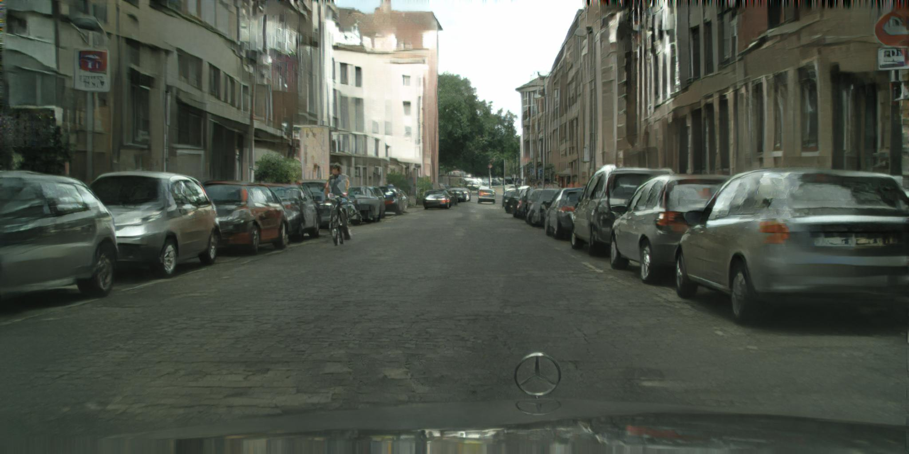

- Label-to-face and interactive editing results

  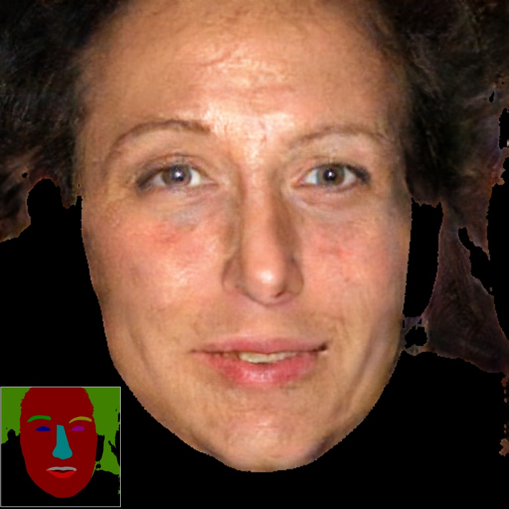
  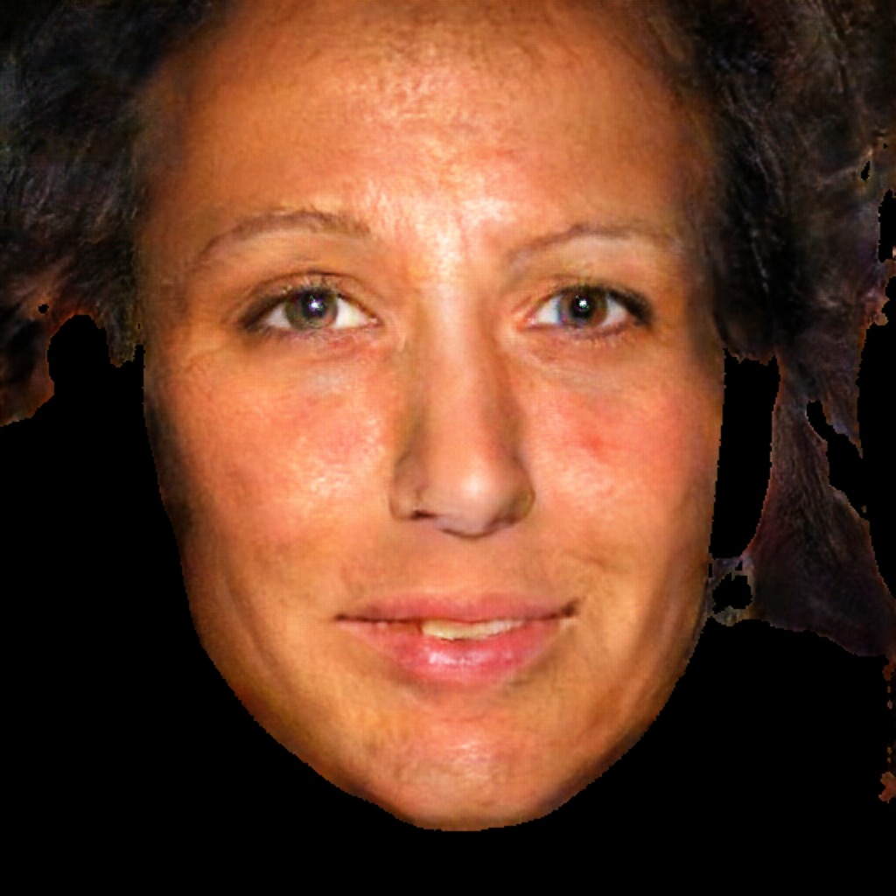
  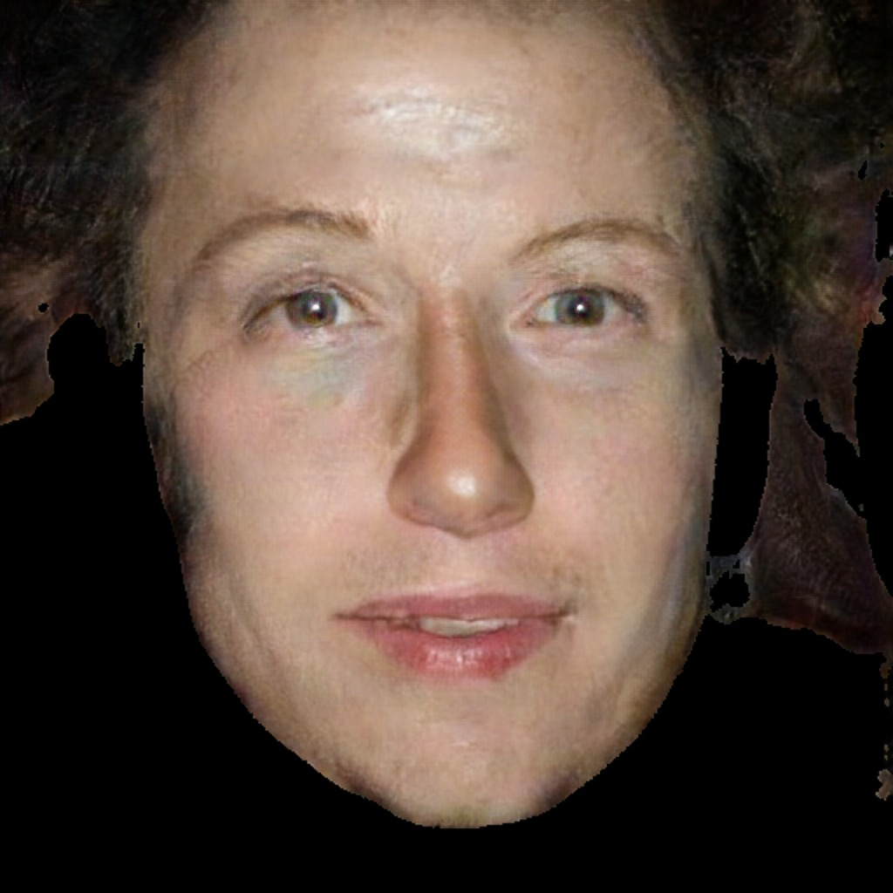

  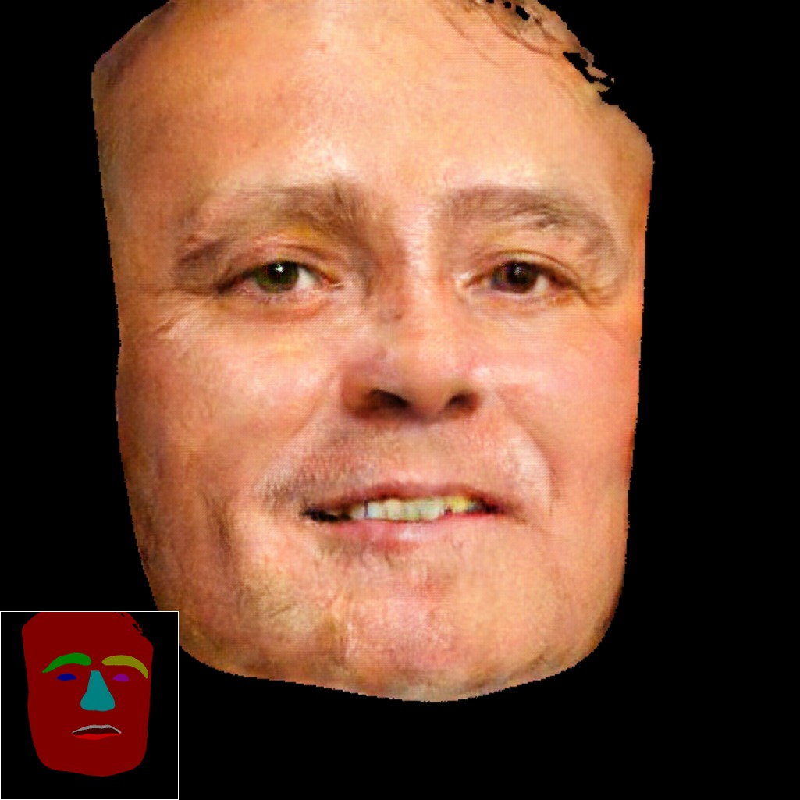
  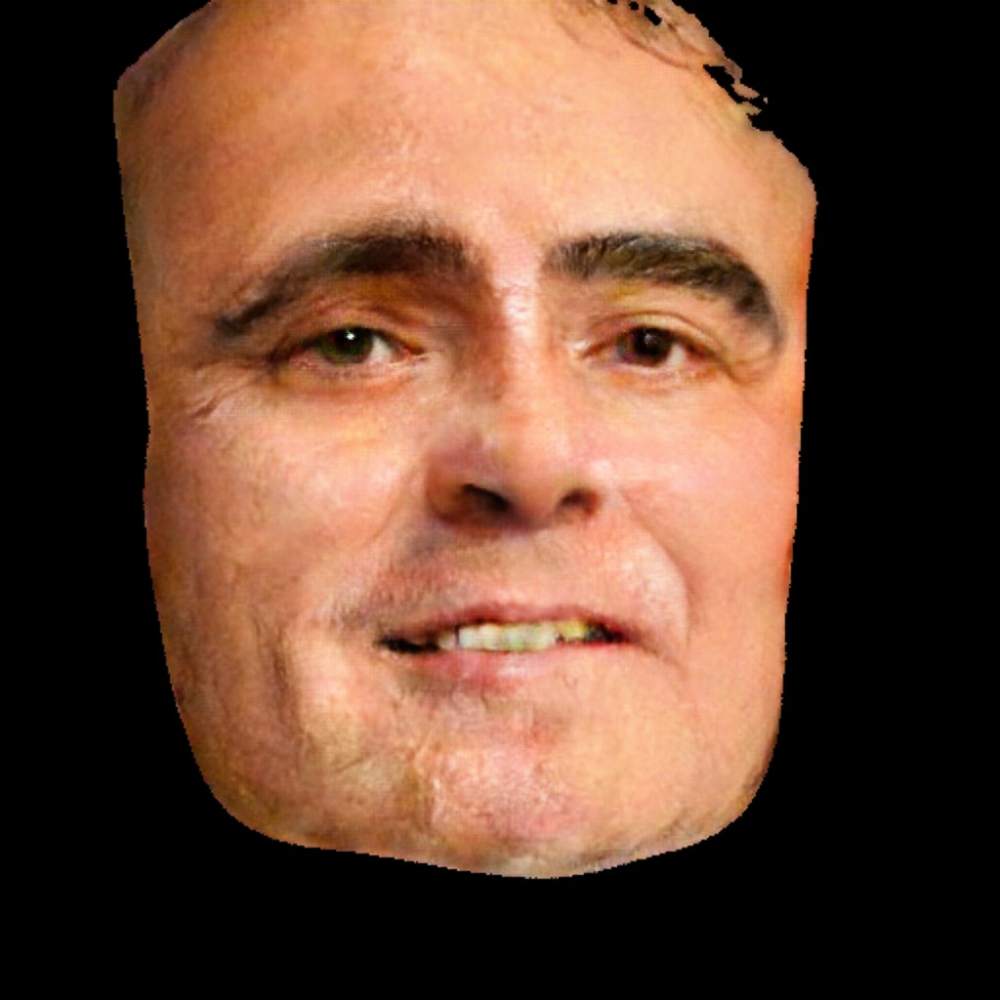
  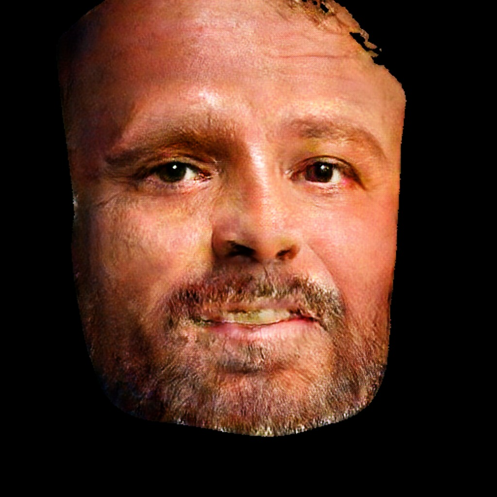

- Our editing interface

  
  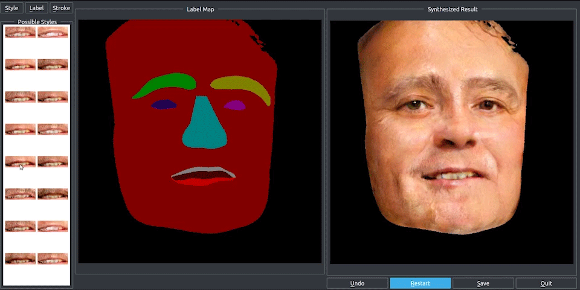

